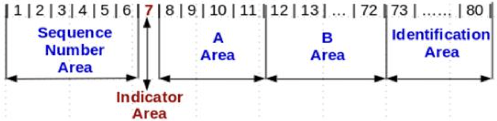

When I first heard about COBOL, what caught my attention was that it is not an object-oriented language.
Coming from a background where most languages I learned were object-oriented, this felt unfamiliar and a little surprising.
It made me curious what kind of language this is, and what coding in COBOL actually feels like. 
With that question in mind, I started exploring COBOL.

---

To begin with, here is the simplest possible “Hello, Yuki” program in COBOL:

```COBOL
   IDENTIFICATION DIVISION.
   PROGRAM-ID. HelloYuki.

   PROCEDURE DIVISION.
       DISPLAY "Hello, Yuki!".
       STOP RUN.
```

At first glance, this program feels quite different from what I was used to.

There are:
- no `{ }` braces
- no `main()` function
- no obvious function calls
- no classes or objects

Instead of looking like typical code, it almost looks like a structured document.
This was my first small hint that COBOL might be designed with a very different way of thinking.

---

## 1. Fixed format

One of the first things I noticed is that traditional COBOL uses a fixed, column-based format.
After reading more about its background, I learned that this design comes from history. Early COBOL programs were written using 80-column punch cards, and each column had a specific purpose. 
Because of this, COBOL source code was divided into different areas on each line.


**The classic COBOL line layout**
- Sequence number area (columns 1–6)
- Indicator area (column 7)
- Area A (columns 8–11) mainly defines the structure
- Area B (columns 12–72) contains most of the actual logic


Modern COBOL compilers often support free format, these column rules are not always required today.
However, many existing COBOL systems still follow this style, so learning it seems important for understanding real-world code.

---

## 2. Structure

A COBOL program is organized very differently from C++.
Instead of using `{}` to create nested blocks, COBOL organizes code -”DIVISION” using clearly named parts:
- IDENTIFICATION DIVISION
- ENVIRONMENT DIVISION
- DATA DIVISION
- PROCEDURE DIVISION

Within these divisions, code can be further organized using:
- SECTION
- PARAGRAPH
- STATEMENTS

Conceptually, it looks like this:
```
DIVISION
SECTION
PARAGRAPH
      STATEMENTS (start from column 12)
```

In COBOL, there are almost no symbols to indicate scope. Instead, scope is defined entirely by structure and hierarchy.
This gave me a feeling that COBOL is closer to SQL than to C++. You must explicitly declare what this part is, what role it plays, and where it belongs.
Both SQL and COBOL seem to focus on describing actions on data in a clear, linear way, rather than emphasizing how those actions are implemented internally.

**Oracle (PL/SQL)**

```sql
CREATE OR REPLACE PROCEDURE hello_world AS
BEGIN
    DBMS_OUTPUT.PUT_LINE('Hello, Yuki!');
END;
/

```

**C++**

```cpp
int main() {
    cout <<"Hello, Yuki!" << endl;
}
```

**DATA DIVISION**

In COBOL, data is usually defined in the DATA DIVISION, using levels and PICTURE clauses to describe both structure and format,
instead of starting with primitive types like `int` or `char` in C/C++.

For example:

**COBOL**
```COBOL
01 CUSTOMER.
   05 CUSTOMER-ID     PIC 9(5).
   05 CUSTOMER-NAME   PIC X(20).

```
**C++**
```C++
int CUSTOMER-ID;
std::string CUSTOMER-NAME;
```

Variables are defined in levels, forming a tree-like structure. This feels similar to encapsulation in a C++ class, but it is only data grouping, not object-oriented programming.
There is:
- No inheritance
- No polymorphism

---

## 3. Terminator

In C++, `{}` are used to define blocks and scope.
In COBOL, the period `.` is an important terminator.
It marks the end of a sentence, which can include one or more statements.

```COBOL
DISPLAY "Hello, Yuki!".

```

This reinforces the feeling that COBOL code is written as a sequence of complete actions, rather than deeply nested expressions.
From what I have seen, careful use of periods is important in larger programs, as they can affect how control flow is read and understood.

When I was learning C++, I was deeply confused by the idea of scope.
At first, I imagined scope as a physical boundary, like a circle drawn around variables. Later, when learning about functions, I thought maybe `{ }` represented a stack frame boundary.
Then new questions appeared:
- Is `{ }` always a function?
- Does an `if` or `while` block create a new stack frame?
- Why can’t variables inside `{ }` be accessed outside?

Over time, I realized that this confusion came from mixing language semantics with implementation details.
In reality, when a block `{ }` exists inside a function, the compiler usually does not create a new stack frame.
The distinction between scopes is handled at compile time, using a symbol table, not by allocating new memory at runtime.

This made me realize something important:
Compiled machine code is about execution, not definition. After compilation, there is no concept of “scope” in the binary—only instructions, registers, and memory addresses.
Even the idea of a stack frame turns out to be an abstraction. Physically, it is just the stack pointer moving, with variables accessed by offsets. There is no real “frame object” in memory.
Seeing this helped me separate two ideas that I used to mix together:
- What the language promises (semantics)
- How the compiler implements it (mechanism)

COBOL shows this perfectly. There’s no deliberate use of `{}` blocks, which naturally pushes me to reason about how the compiler parses the language.
When I was learning C++, I was often trapped by scope. Abstraction is meant to improve understanding, yet I found myself confused by the semantics of the language itself.

---

## Closing thoughts

I initially approached COBOL out of curiosity about an old language.
What I didn’t expect was that it would challenge my understanding of modern ones.

By removing familiar symbols and abstractions, COBOL made me more aware of how much of what I “knew” about scope, functions, and objects was shaped by language design, not by how programs actually run.

In that sense, learning COBOL was not about going backward.
It was about seeing the abstractions I rely on more clearly, by temporarily letting them go.